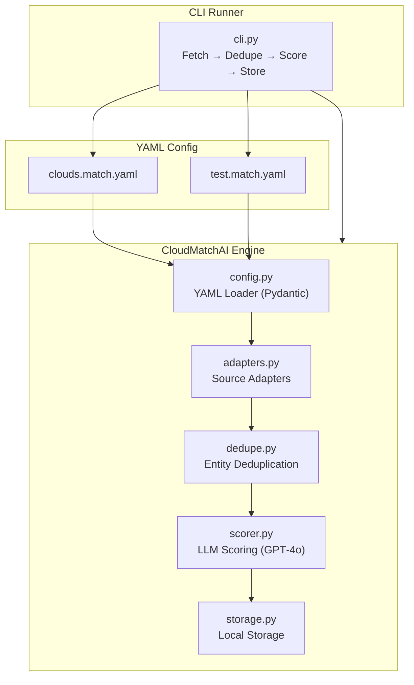
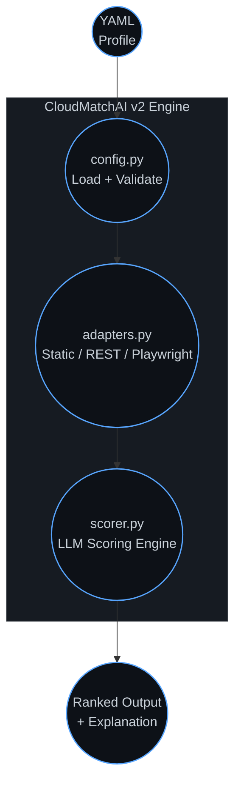

CLI runs the whole thing
…got swallowed by the chat formatting.

That’s why you never got the full README.
That’s why GitHub has nothing to render.
That’s why your file ends early.

So let’s fix this cleanly.

✅ Here is the FULL README.md again — in ONE SINGLE BLOCK — with ALL code fences properly closed
Paste this into your blank README.md exactly as-is.
This time it will not cut off.

📄 FULL README.md — COPY EVERYTHING BELOW
markdown
# ⚡ CloudMatchAI v2
A precision-built, YAML‑driven scoring engine for anything worth ranking.

CloudMatchAI v2 is a clean reboot — a modular, adapter‑based engine that takes structured input, applies weighted logic, and lets an LLM do the heavy lifting on evaluation.  
It’s lean. It’s sharp. It’s not here to hold your hand.

If v1 was a job scraper with opinions,  
**v2 is a scalpel.**

---

## 🚀 Why v2 Exists
Because the world doesn’t need another bloated “AI platform.”  
It needs a simple, composable engine that can score:

- cloud providers  
- job listings  
- apartments  
- tequila brands  
- dogs  
- anything with attributes  

Change the YAML → change the universe.  
No rewrites. No drama.

---

## 🧩 Core Concepts (No BS)

### **YAML is the source of truth**  
Profiles, criteria, adapters — all defined in `.yaml`.  
You don’t touch Python unless you want to.

### **Adapters do the fetching**  
Static, REST, Playwright — or whatever you write next.  
One class = one data source.

### **LLM does the scoring**  
Weighted criteria + GPT‑4o = ranked, explained results.

### **CLI runs the whole thing**
---

## 🧱 Architecture (Principal‑Level System Map)


## 🧭 System Map (High‑Level Flow)




 


📂 Repo Layout (v2‑clean, no dead weight)
```
CloudMatchAI/
│
├── adapters.py          # pluggable data sources
├── cli.py               # command-line runner
├── config.py            # YAML loader + validation
├── scorer.py            # LLM scoring engine
├── clouds.match.yaml    # example cloud scoring profile
├── test.match.yaml      # minimal static test profile
├── requirements.txt
├── README.md
│
├── legacy_v1/           # entire v1 system quarantined
├── docs/                # optional docs
└── logs/                # runtime logs
```
If it’s not part of the v2 engine, it lives in legacy_v1/ where it can’t hurt anyone.


📝 Example Profile (test.match.yaml)
yaml
profile:
  adapter: static
  criteria:
    cost: 0.4
    performance: 0.4
    support: 0.2
This is the “does the engine even run” profile.
It does.

▶️ Run It
bash
python cli.py test.match.yaml
Example output:

Code
Provider: AWS
Score: 0.87
Breakdown:
  cost: 0.8
  performance: 0.9
  support: 0.7

Explanation:
AWS performs strongly in performance and cost efficiency...
----------------------------------------
Swap the YAML → score something else.
The engine doesn’t care.


## 🔌 Adapters (The Real Power Move)

```
StaticAdapter
    • For testing
    • Zero dependencies
    • Zero excuses

RestAPIAdapter
    • Point it at an API
    • It fetches
    • You score

PlaywrightAdapter
    • For dynamic sites
    • Use it when the data refuses to sit still

Write your own
    • One class
    • One method
    • Infinite possibilities
```

## 🧠 Scoring Engine (LLM‑backed, not LLM‑bloated)

```
scorer.py handles:

    • Weighted scoring
    • Structured breakdowns
    • LLM‑generated explanations
    • Consistent ranking

Design philosophy:
    • Intentionally small
    • Easy to tweak
    • No machete required
```

## 🗂️ Legacy v1 (Quarantined, but preserved)

```
legacy_v1/
    • Entire v1 job‑scraper system
    • Not loaded
    • Not imported
    • Not part of v2 runtime
    • Kept only for historical reference
```

Everything from the chaotic v1 era lives here — safely isolated where it can’t interfere with the v2 engine.


## 🤝 Contributing

```
Want to extend CloudMatchAI?

    • Add new adapters
    • Create new scoring profiles
    • Improve documentation
    • Enhance performance
    • Tighten architecture

Design principles:
    • Small surface area
    • Clear boundaries
    • Easy to extend
    • No unnecessary complexity
```

Pull requests welcome — just keep it sharp.


## 📜 License

```
MIT License

    • Free to use
    • Free to modify
    • Free to distribute
    • No warranty
    • No liability

In short:
    • Do whatever you want
    • Just don’t blame me if you aim this at tequila brands and start a bar fight
```
